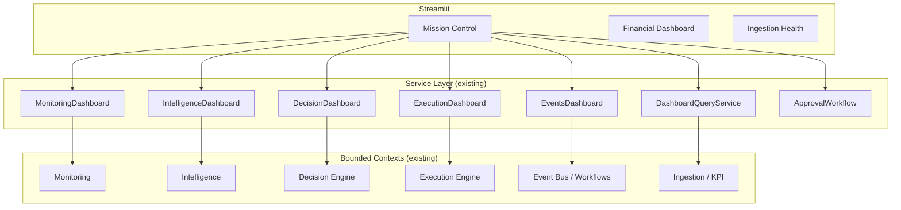

# WP3.0 — Unified COO Workspace (Mission Control)

## Objective

Build **one** executive workspace that becomes the daily operating centre for the business. No new backend subsystems were added. Existing APIs were wired into a single Streamlit landing page.

## Principles

- No duplicated business logic
- No duplicated KPI calculations
- No duplicated SQL
- Dashboard consumes APIs only
- Mission Control becomes the default homepage

## Deliverables

| Deliverable | Path | Status |
|-------------|------|--------|
| Mission Control page | `pages/mission_control.py` | ✅ |
| Navigation update / default homepage | `streamlit_app.py` | ✅ |
| Dashboard API integration | Through `DashboardQueryService` + domain dashboards | ✅ |
| Verification output | This note + test output | ✅ |
| Architecture diagram | Mermaid below | ✅ |
| Engineering closeout report | This note | ✅ |
| Full regression results | 194 tests passing | ✅ |

## Architecture



## Sections Implemented

### 1. Executive Summary

- Business Health (from `MonitoringDashboard.get_health_snapshot()`)
- Revenue Today (from `DashboardQueryService.get_pl_summary` for today)
- Gross Profit (from `DashboardQueryService.get_pl_summary` for today)
- Orders (from `DashboardQueryService.get_order_list` for today)
- ROAS (from `DashboardQueryService.get_ad_performance_summary` for today)
- Active Alerts (from `MonitoringDashboard.get_open_alerts()`)
- Open Decisions (from `DecisionDashboard.get_decision_summary()`)
- Running Workflows (from `EventsDashboard.get_running_workflows()`)
- Running Executions (from `ExecutionDashboard.get_running()`)
- Last Successful Sync (from `DashboardQueryService.get_freshness()`)

### 2. Priority Actions

- Displays only highest-priority decisions via `DecisionDashboard.get_high_priority()`
- Each card shows severity, category, description, recommended action, expected impact, confidence, evidence
- Buttons: **Approve**, **Reject**, **View Details**
- Approval uses existing `ApprovalWorkflow.approve()` / `reject()` — no automatic execution

### 3. Operations Monitor

Tabs:
- System Health (`MonitoringDashboard.get_system_health()`)
- Sync Health (`DashboardQueryService.get_freshness()`)
- Workflows (`EventsDashboard.get_running_workflows()` + event summary)
- Executions (`ExecutionDashboard.get_execution_summary()` + running)
- Dead Letters (`EventsDashboard.get_dead_letters()`)

### 4. Intelligence Feed

- Chronological feed of business insights via `IntelligenceDashboard.get_priority_insights()`
- Expandable cards with explanation and evidence
- Severity badges (critical, high, warning, info)

### 5. Execution Centre

- Recent Executions (`ExecutionDashboard.get_recent_executions()`)
- Queue (`ExecutionDashboard.get_execution_queue()`)
- Failed / Retryable (filtered from recent executions)

### 6. Event Stream

- Latest system events via `EventsDashboard.get_recent_events()`
- Event summary JSON

## Navigation

- Sidebar links to Mission Control, Financial Dashboard, and Ingestion Health
- `streamlit_app.py` now redirects to `pages/mission_control.py` on load
- Existing pages remain functional for backwards compatibility

## Verification

### 1. No direct SQL in Mission Control

Checked with ripgrep:
- No `session.query`, `filter_by`, `filter`, `add`, `commit`, `delete` calls
- No `sqlite3` or raw SQL strings
- The only SQLAlchemy imports are the UoW factory classes (`SQLAlchemy*UnitOfWork`), which are injected into the dashboard APIs
- All data reads go through dashboard APIs (`MonitoringDashboard`, `IntelligenceDashboard`, etc.)

### 2. No marketplace calls in Mission Control

Checked with ripgrep:
- No `requests.get`, `requests.post`, `hmac.new`, `partner_id`, `access_token`
- No `ShopeeApiClient`, `ShopeeConnector`, `fetch_orders`, `fetch_campaigns`, etc.
- Marketplace interactions are entirely delegated to the Execution Engine and are only triggered by explicit approval + plan execution

### 3. Regression tests

```
194 passed in 16.66s
```

### 4. Existing pages still working

- `pages/financial_dashboard.py` unchanged
- `pages/ingestion_health.py` unchanged
- `streamlit_app.py` converted to a thin redirect

## Files Changed

- `pages/mission_control.py` — new
- `streamlit_app.py` — simplified to redirect to Mission Control

## Definition of Done

- [x] Mission Control renders using only service APIs
- [x] No direct SQL inside pages
- [x] No marketplace calls inside Streamlit
- [x] Regression tests still pass
- [x] Existing pages continue working
- [x] Architecture diagram documented
- [x] Engineering closeout report written

## Next Work Package

WP3.1 — **Morning / Evening COO Briefs**
- Autonomous generation of operational briefs from the same APIs
- Written to Obsidian and optionally Telegram
- Focus on actionable open items, risks, and decisions awaiting approval
